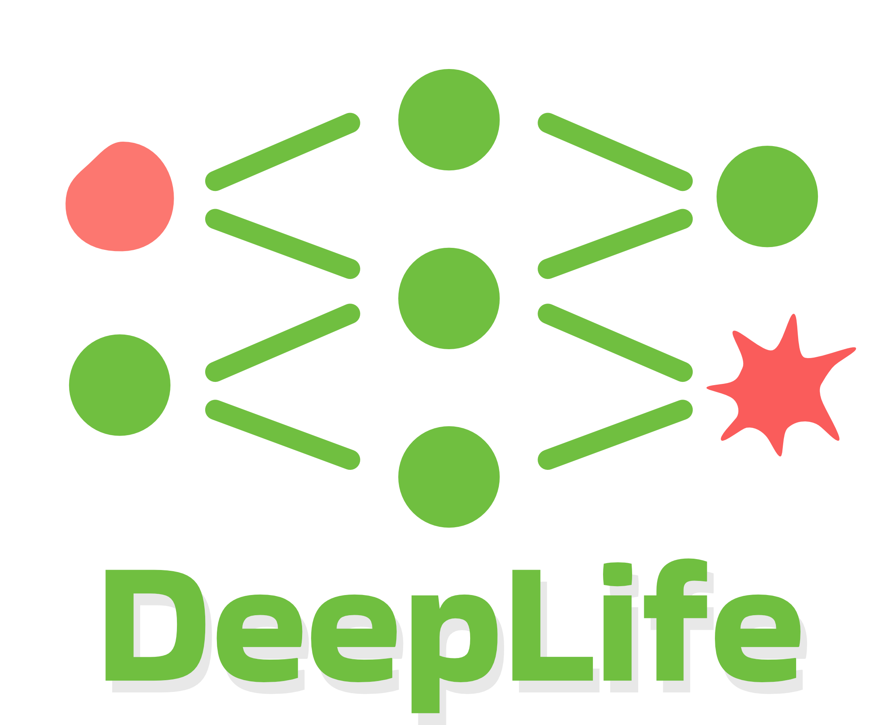

## MoBi Master Seminar -- Deep Learning in Life Sciences (DeepLife)

As part of the **Seed4EU+ action within the 4EU+ alliance of European university**, Heidelberg University will coordinate a joint course on Applications of Deep Learning in Life Sciences (DeepLife) involving the universities of Paris-Sorbonne, Warsaw, Prag, Milano and Heidelberg. The purpose of this course is to give an insight in the very active field of DL in the field of biomedicine and highlight recent examples of applications in three distinct areas: 

* single-cell genomics
* protein bioinformatics
* biomedical image analysis.

### Organization

This course will be organized in 4 blocks over 14 weeks (start: week of 26.02.2024) 

1.	Basic concepts in deep learning – 4 weeks 
2.	DL in single-cell genomics – 3 weeks 
3.	DL in protein bioinformatics - 4 weeks 
4.	DL in image analysis – 3 weeks

The course format will comprise a **weekly 90-minute online lecture** and a **weekly hybrid (in-person/online) practical Python session**. Lectures will be given by teachers from all participating universities. Lectures and practical exercises on all three application areas will be centered around one recent publication illustrating a specific application and method. 

The course will end with a 2-day workshop and hackathon meeting in Heidelberg in June 2024 during which students will be able to implement a short project and listen to scientific lectures.

### Intended audience and evaluation

DeepLife is designed for master's students from the participating universities, as well as those enrolled in graduate schools. Evaluation will be based on a final online exam and the assessment of practical exercise assignments. Ahead of the course, we will provide a list of prerequisites and the relevant teaching resources to cover fundamental concepts. Successful participants will earn 4 ECTS credits.

### Contact person for information

Prof. Dr. Carl Herrmann – IPMB
carl.herrmann@uni-heidelberg.de

Registration: sabrina.wetzel@uni-heidelberg.de

