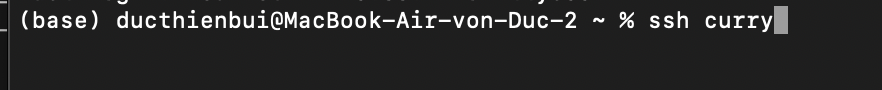
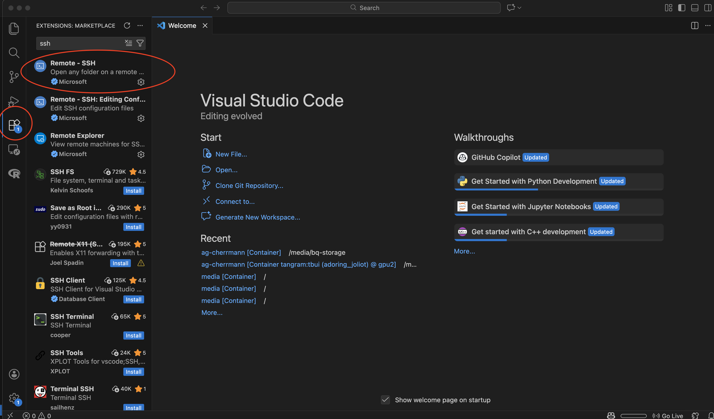
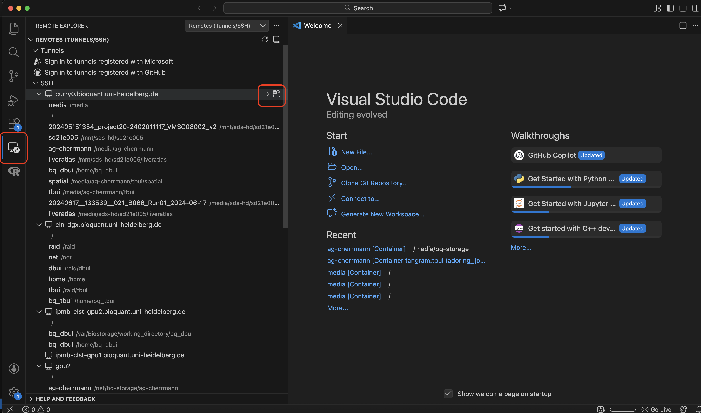
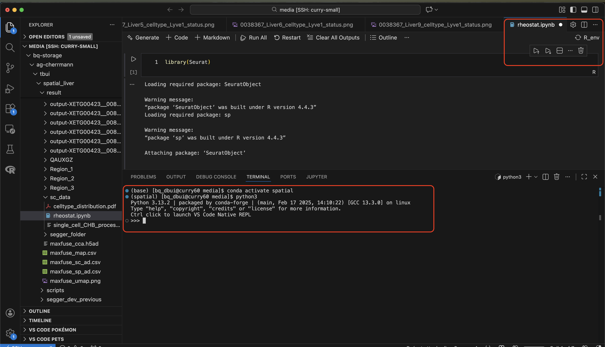

# Getting started  

## Getting access to the cluster

There are 2 clusters available for working:

1. **BioQuant Cluster**: this is the general cluster of the institute;
2. **Curry cluster**: this is the cluster we share with the Rippe group, which is dedicated to single-cell analysis and other tasks. It comes equipped with an RStudio Server and a Jupyter server.

In addition, we have a **DGX GPU workstation** and two servers **GPU1 and GPU2** on which you can run applications optimized for GPU architecture. For access to the workstation and the servers, contact Pranab. Discuss with your supervisor beforehand whether you need GPUs or not and which one you should use.

You might also need to access other clusters which we use mostly for heavier data storage or more computationally demanding tasks.
1. **BQ-storage:** registration with the Bioquant IT (Pranab) and login with Kerberos-ticket is required. We mostly use it for large datasets. 
2. **DKFZ cluster:** Part of the DKFZ infrastructure. You will only have access if you are taking part in a project together with DKFZ research groups. 
3. **BW-cluster:** part of a state-wide initiative of Baden-Württemberg aimed for cooperative provision of resources and service structures. You can find more information here.
4. **SDS@hd:** part of the same initiative as BW-cluster, but more focused on data storage. More information here.

In order to safely access a document containing SSH commands for the clusters you will use, refer to [this](https://docs.google.com/document/d/1xTSGF7gOYrq-1-SxJcBTAbc3K4H1yOZELgM_iUwFrNM/edit?usp=sharing) Google document.

[Here](https://help.dreamhost.com/hc/en-us/articles/216499537-How-to-configure-passwordless-login-in-Mac-OS-X-and-Linux) is a simple guide to add your personal ssh-key to the cluster in order to not have to type in your password every time (it's also needed for proxyjumping to curry-nodes with VS-Code).

An example for your local config-file can be downloaded [here]({{ site.url }}{{ site.baseurl }}/downloads/wiki/config) 

## Quick start to cluster
After getting access and configuring your ssh config file accordingly, you can start by either using ssh via your terminal

or connecting via VS-Code. For VS-Code, you will have to install the "Remote - SSH" extension

Then you can just connect like this. Select the appropriate connection (a computing node if you want to run code):

If you want to test code in the terminal, then run "R" or "python3" after activating your [conda environment](03_cluster_howto.md/#using-miniconda), alternatively you can also run your jupyter notebook.


## Creating your project folder

### Group storage area

After getting access and changing your password, the next step will be to create your working directory in our group folder. You are already logged into the cluster (Bioquant), now simply type the following commands in your terminal -

```{bash}
cd /net/bq-storage/ag-cherrmann/
ls 
```

Here all the users (members of the lab) will create their personal work directories. 

> Kindly follow the nomenclature of **f**irst name **last name** (all in small caps) while creating your personal work directories. So for instance **Jane Doe** will be **jdoe**.

```{bash}
mkdir jdoe # NOTE - use your own naming scheme instead of jdoe
```

On the curry cluster, the same storage area is mounted under

```{bash}
/media/bq-storage/ag-cherrmann
```


### Your folder structure

For simplicity and future interpretability we encourage that every project folder follows the following basic sub-folder structure. Of course, you can add more folders or sub-sub folders as required but try to maintain this basic internal structure for improving readability for third persons.

```{bash}
-myProjectName
  ├── analysis    # for storing all the results generated from the analysis
  ├── data        # for storing all the input data required for the analysis
  ├── src         # for storing all your scripts
  ├── logs        # for storing all the intermediate log files generated while running your scripts
  ├── temp        # a temporary buffering folder to be used as you please
  ├── docs        # for storing all the papers relevant to this project, presentations, project report etc
  └── README.txt  # detailed description of the project, scripts etc
```

Please copy the folder to your location with following command
```{bash}
cp -r /net/bq-storage/ag-cherrmann/students_start/myProjectName /path/to/location
```

Change the name of the folder correspondingly
> Never have spaces in your folder name, use a combination of small and upper caps for easily readable folder names !!

> PROTIP - Name the scripts in your src folder as 1_script.R, 2_script.py, 3_script.sh ... The numbering should follow the ordering of script execution. This will be very helpful for others trying to execute/understand your scripts later on. Similarly you could names files/folders in the analysis folder as 1_result.pdf, 2_result.xlsx, 3_result.jpeg ...

Now, an important question you have to ask yourself is whether you need GPUs. In general, GPUs are needed for simple calculation tasks which one can parallelize. In our case it's most oftentimes training of models in machine learning and specifically in deep learning. If the answer for your script is yes, you want to work on the **DGX GPU workstation** or one of the two servers **GPU1 and GPU2**. If you don't need GPUs, you may proceed with the curry cluster. If you don't know whether you need GPUs try to scan the imports in the scripts for either torch, tensorflow or pyro as these are the typical frameworks used for deep learning. If you do need GPUs ask your supervisors which ressource you should use.

## Public data downloads

Throughout your stay with our group, you might use public data in your project. 
Depending on the nature of your project, here are some repositories which can help you find datasets: 

1. GEO (largest functional genomics repository with raw and processed data published on all sorts of technologies - from microarray to single-cell);
2. ENCODE (large repository specialised on gene regulation containing data from undisturbed cell lines and tissues - raw and processed using the same methodologies);
3. TCGA (standard cancer genomics database).

Smaller databases but specialised for single-cell datasets (mainly already processed):  
1. UCSC Cell Browser (serves both as repository and explorer of processed single-cell dataset);
2. Single Cell Portal (repository to processed data on ~600 single-cell studies);
3. CZ CELLxGENE (single-cell, includes processed datasets).  

If you think a dataset you downloaded could be useful to others and/or is relatively large (more than ~100GB), you can add it to the [groups’ dataset sheet](https://docs.google.com/spreadsheets/d/1ildocNb9Bi8girF1vFy6kn9aARzHem3KJo-RegT1cOU/edit?usp=sharing).  

Such datasets should ALWAYS be accompanied by a READme indicating when they were downloaded, and any differences in version(s), among other features which can help anyone else using them.  

On the other hand, you should also refer to this sheet to verify if the data you are downloading is already stored in our cluster. 


