# DGX Workstation and GPU1/GPU2 Servers

## Guide on how to use our NVIDIA GPU workstation and GPU1 and GPU2 servers

## First steps

For access to the workstation, please contact Pranab.

Once your access has been approved, a user account will be set up for you:

e.g. if your Name is Max Mustermann, your USER ID will be bq_mmustermann

You will also receive an initial password that you will have to change after your first login.

To log in onto the station, type:
```
ssh bq_mmustermann@cln-dgx.bioquant.uni-heidelberg.de
```
The workstation is integrated in the BioQuant network, but does not belong to the BioQuant cluster. As long as you have access to the BioQuant network, you should in principle also have access to the workstation.

Your home folder will be located at:
```
/home/bq_mmustermann
```
Storage capacity in this folder is limited, so try to store your data in the folder you created in bq-storage. The folder of our lab is mounted as 

```{bash}
/net/bq-storage/ag-cherrmann
```

## Working on the GPU station and servers
On this workstation, we work exclusively in docker environments. This has two main reasons:

1) It is not that easy to properly configure an environment that is GPU enabled, and popular applications like rapids or pytorch already provide ready-to-use environments that have been extensively tested.  
2) The storage space on the work station is limited, and the docker environments can be shared by all users.


#### a) Retrieving/modifying docker images

When pulling GPU enabled docker images, one has to make sure that they have the right CUDA version installed.  
You can run ```nvidia-smi```on the cln-dgx and check its output:

Here you can see that our workstation has four GPUs available and that the CUDA version is 12.0 is installed.

```
+-----------------------------------------------------------------------------+
| NVIDIA-SMI 525.147.05   Driver Version: 525.147.05   CUDA Version: 12.0     |
|-------------------------------+----------------------+----------------------+
| GPU  Name        Persistence-M| Bus-Id        Disp.A | Volatile Uncorr. ECC |
| Fan  Temp  Perf  Pwr:Usage/Cap|         Memory-Usage | GPU-Util  Compute M. |
|===============================+======================+======================|
|   0  Tesla V100-DGXS...  On   | 00000000:07:00.0 Off |                    0 |
| N/A   33C    P0    35W / 300W |     27MiB / 32475MiB |      0%      Default |
+-------------------------------+----------------------+----------------------+
|   1  Tesla V100-DGXS...  On   | 00000000:08:00.0 Off |                    0 |
| N/A   32C    P0    36W / 300W |      0MiB / 32478MiB |      0%      Default |
+-------------------------------+----------------------+----------------------+
|   2  Tesla V100-DGXS...  On   | 00000000:0E:00.0 Off |                    0 |
| N/A   33C    P0    37W / 300W |      0MiB / 32478MiB |      0%      Default |
+-------------------------------+----------------------+----------------------+
|   3  Tesla V100-DGXS...  On   | 00000000:0F:00.0 Off |                    0 |
| N/A   33C    P0    36W / 300W |      0MiB / 32478MiB |      0%      Default |
+-------------------------------+----------------------+----------------------+
                                                                               
+-----------------------------------------------------------------------------+
| Processes:                                                       GPU Memory |
|  GPU       PID   Type   Process name                             Usage      |
|=============================================================================|
|    0      2111      G   /usr/lib/xorg/Xorg                             9MiB |
|    0      2140      G   /usr/bin/gnome-shell                          15MiB |
+-----------------------------------------------------------------------------+
```

For example, if you want to obtain the docker image for pytorch, you can run:
```
docker pull pytorch/pytorch:1.6.0-cuda10.1-cudnn7-runtime
```
Again, make sure it has the right CUDA version!

The image for pytorch has already been pulled, so feel free to use it.

To see all docker images which are currently available, just type:

```
docker images

REPOSITORY          TAG                               IMAGE ID            CREATED             SIZE
pytorch             lightning                         5bc730d29aab        7 days ago          4.21GB
rapids              with_dask-optuna                  12ba7b2ada2a        2 months ago        8.23GB
pytorch             with_torch-sparse                 2a1b1a5cd7f7        2 months ago        3.74GB
rapidsai/rapidsai   cuda10.1-base-ubuntu16.04-py3.8   b02068c722e8        3 months ago        8.21GB
pytorch/pytorch     1.6.0-cuda10.1-cudnn7-runtime     6a2d656bcf94        6 months ago        3.47GB
```

The two images at the bottom of the output are images that were pulled from the official docker repositories.
The three images at the top are based on these images and have some packages installed on top of them. 

In /net/bq-storage/ag-cherrmann/students_start/docker/.devcontainer there is an example folder for the creation of a docker image. If you want to create a new image, copy that folder and rename it to be the name you want

```{bash}
mkdir /path/to/directory/.devcontainer
cp -r /net/bq-storage/ag-cherrmann/students_start/docker/.devcontainer/SWITCH /path/to/directory/.devcontainer/name_of_docker_image
```

Please modify the docker name 

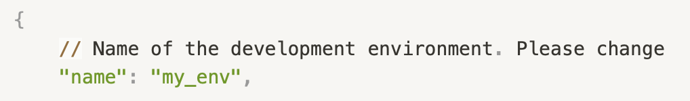

and the image name 

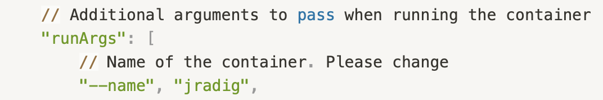

Such that we know who did what. 

The following line is the most important:

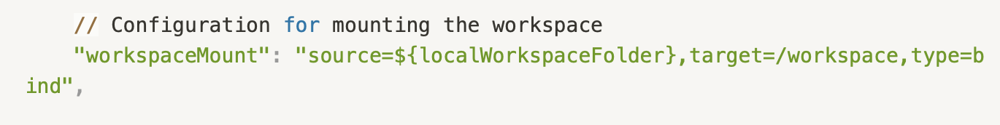

It mounts all the files that you have on your cluster's workspace to the docker, in a folder that is called workspace. Hence all the files you have on the cluster will be accessible from the container. **Attention**, if you create folders from within the container (it will become clear at some point), you won't be able to scp to or from them, since you have created them from the container, and not from the cluster. If you want to scp stuff, create a folder on the cluster, and then open the project in the container. You will understand once you encounter the issue. Keep this warning in mind. 


#### b) Dockerfile

The Dockerfile specifies the image (kind of like a virtual machine, though not quite) that is going to be used. Since I was working on deep learning, I pulled the PyTorch image. This image ensures there are no compatibility issues between your hardware and software (essentially, you can run tasks on the GPUs without problems). Additionally, you download the terminal widget you prefer (such as Nano, Vim, Unzip, and so on) and the packages you want to have installed (for example, Scanpy, Pandas, and others).

The most important packages should be installed but feel free to add more to your own Dockerfile if needed.

#### c) Building the docker image
Change to the location in which your Dockerfile and devcontainer.json are located in and run the docker build command with a tag (-t) of your choice so that you can find your docker image
```{bash}
cd /path/to/docker_directory
docker build -t name_of_container:mmustermann .
```

#### d) Working in docker containers
First, you'll have to build a docker container from your image. This can be done using this command
```{bash}
docker run -it --rm --gpus all --memory="100G" --user $(id -u):$(id -g)   -e HOME=/workspace   -v /net/bq-storage/ag-cherrmann:/media/bq-storage/ag-cherrmann   -v $(pwd):/workspace   --workdir /workspace --entrypoint /bin/bash maxfuse:tbui
```

The flag ```--gpus```will specify how many GPUs the container will have access to, e.g. if you set ```--gpus 1```, the container will only be able to recognize and use 1 GPU, although we have 4 GPUs on the machine.

You have to be careful here, because by default, e.g. if you set ```--gpus 1```, docker will always use the first GPU. If some GPUs are currently in use, make sure to check with the ```nvidia-smi``` command which GPUs still have memory available, and then explicitly specify the GPU like this:


```{bash}
docker run --gpus device=1 all -p 8888:8888 --rm -ti -v /raid/ddoncevic/projects/:$HOME pytorch:lightning
```

The GPUs are 0-indexed, so ```device=0``` will use the first GPU, ```device=1``` the second GPU and so on.

The flag ```-p```is used for port-forwarding. If you want to output anything on your local machine, e.g. you want to work with the tensorboard or a jupyter notebook, you will have to use port forwarding when starting the container. Be careful that you also have to have already forwarded the port you want to use when connecting to the workstation via ssh.

The flag ```--rm```is optional. If this flag is set, then the container will automatically be deleted after you exit from the container.

The flag ```-v```is used to mount a folder to the container environment. This is neccessary, as otherwise you will not have access to your data and scripts from within the container.

At the end, you need to specify the docker image that the container should be started from.

For Mac-users you can now hit cmd + shift + P and choose ```Dev Containers: Attach to running Container...```


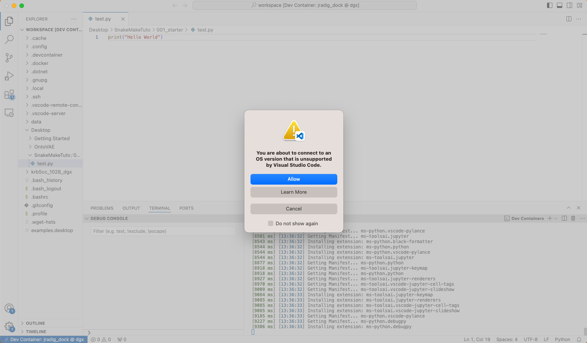

You are in the devcontainer! Hurray!

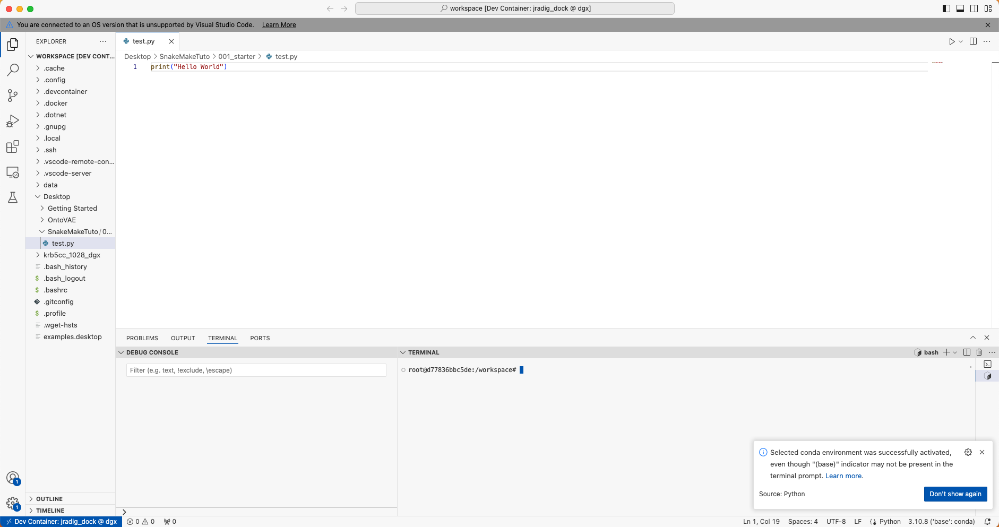

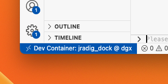

The terminal looks like this and you can use it like normal:

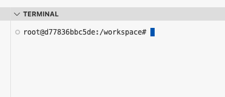

See, all the files you had on your cluster's workspace are now inside the container under the folder workspace. 

I can for instance run a python file from the terminal, like usual:

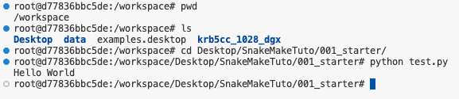

I can create a Jupyter notebook, just select the default kernel. 

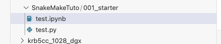


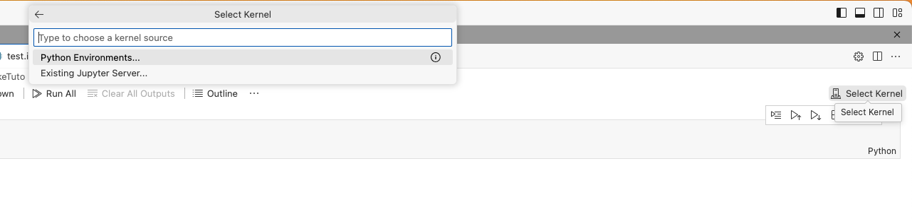

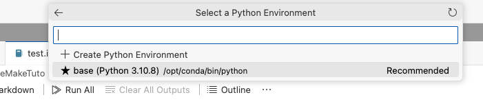

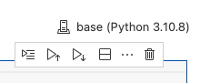

And run it as usual.

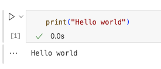

You can import .py files in your Jupyter notebooks and all other stuff that you can usually do. 

But the most interesting thing, is that you can debug! Never used debugging? Google. In vscode you need to install an extension, easy. Then you can do e.g. the following.

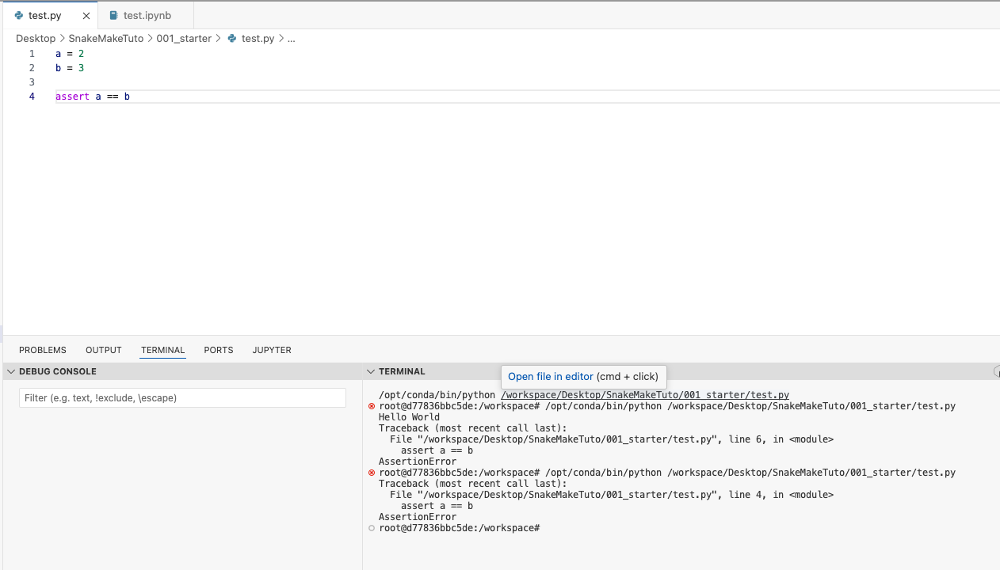

It returns an error, let's debug. Set a flag (red dot, just click on the left of the line numbers to the line you wish the code to stop) and hit the run button with the bus on the left bottom corner:

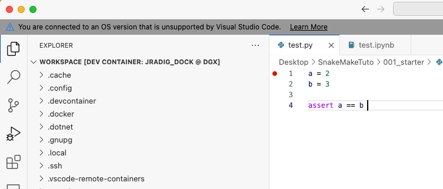

Hit run and debug. Actually I suggest that you create the launch.json file they propose to automatically write for you. This will ensure that, each time you hit debug, it debugs the file that is currently open. 

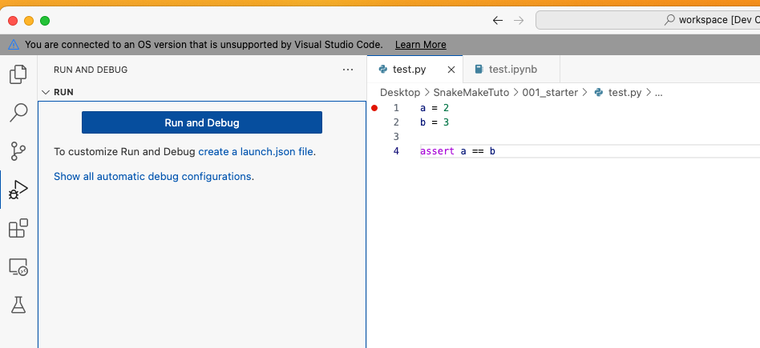

Hence it does this step automatically:

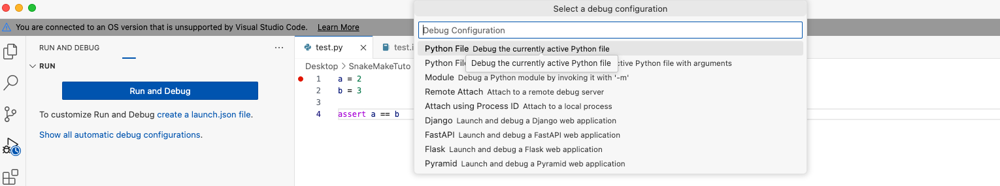

You enter debug mode and you can debug as usual (look YouTube videos to understand how to debug. Don't wonder whether it's worth the time. It is.)

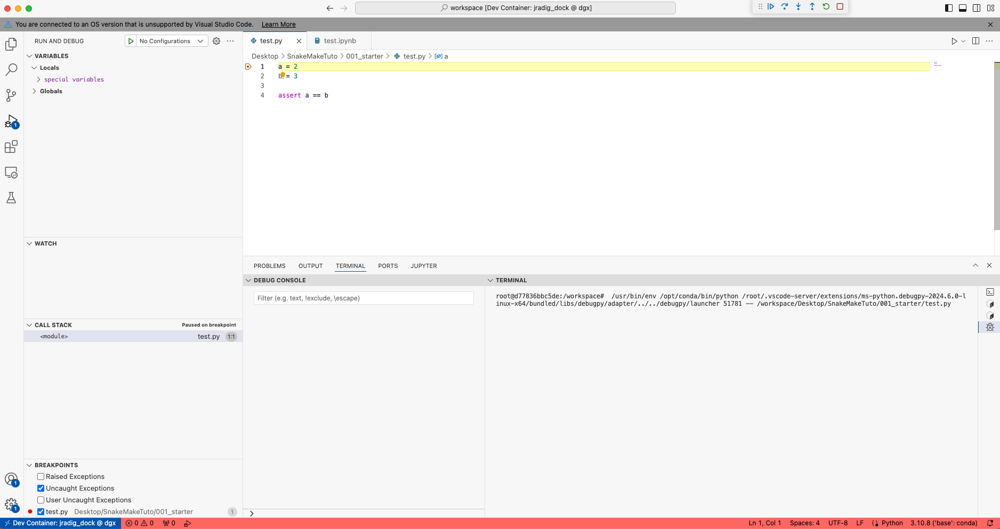

## Coming back to the devcontainer after having logged out


At the end of this tutorial, at some point, you are going to go home, and the connection to the cluster will be lost. You will have to reopen your work environment the next day. We are the next day. You reboot your computer. How to go back to your devcontainer and continue working? Follow me. 

Open vsCode. 
 

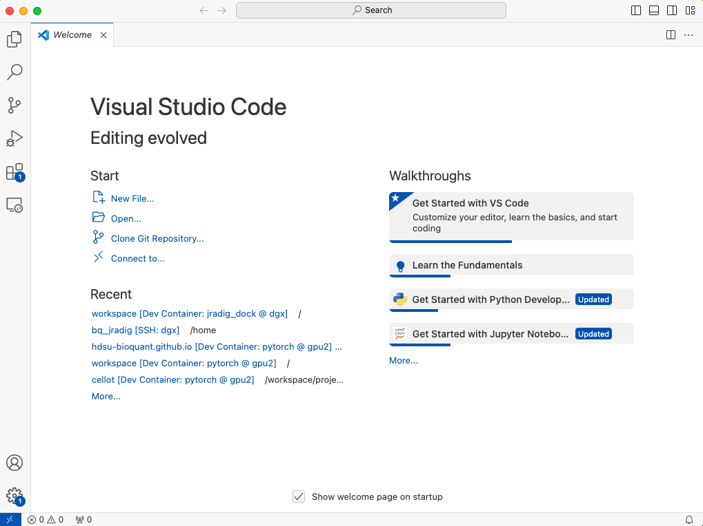

Connect to DGX

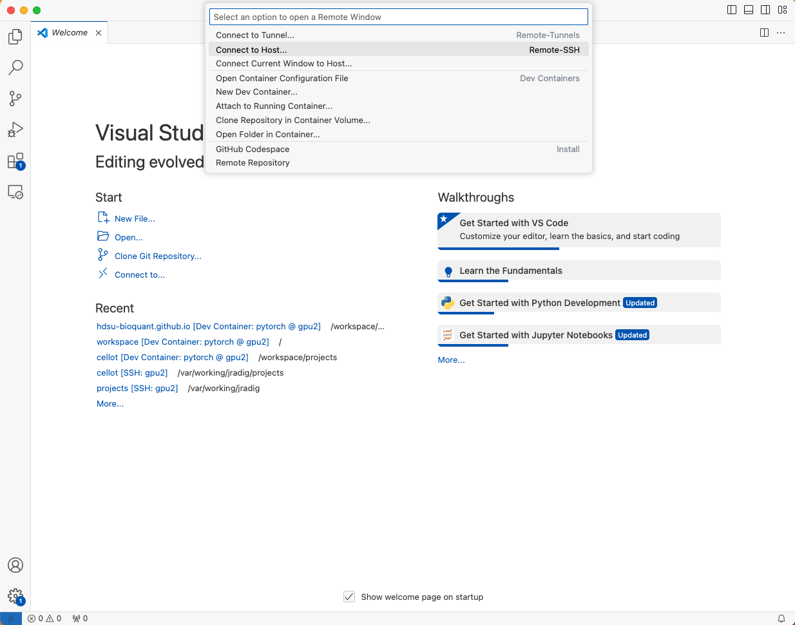

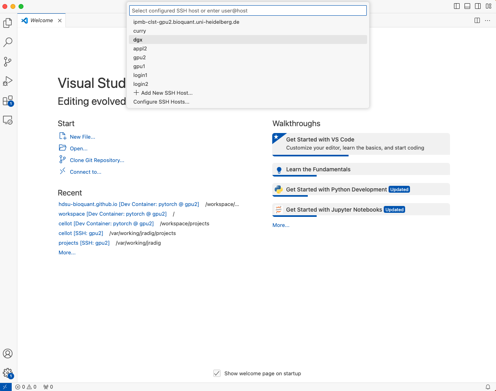

You were too lazy to create the key-authentification yesterday? You can still do it now.

The new window opens, you are connected to DGX. 

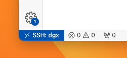

Click the TV icon:

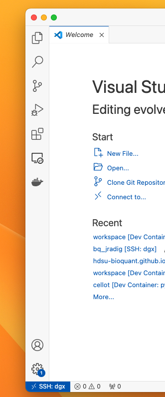

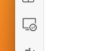

Click on the drop-down menu “Remotes (Tunnels/SSH)”

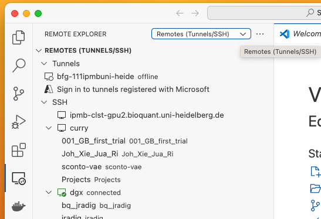

Select Dev Containers

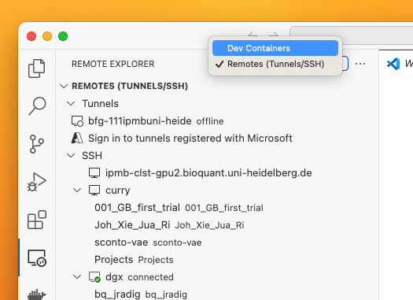

You can see all the devcontainers that were created, in particular yours (mine is bq_jradig jradig_dock)

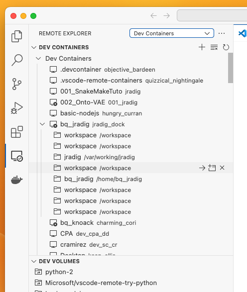

I want to go to my workspace and I click the arrow.

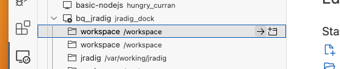

I am back in my devcontainer

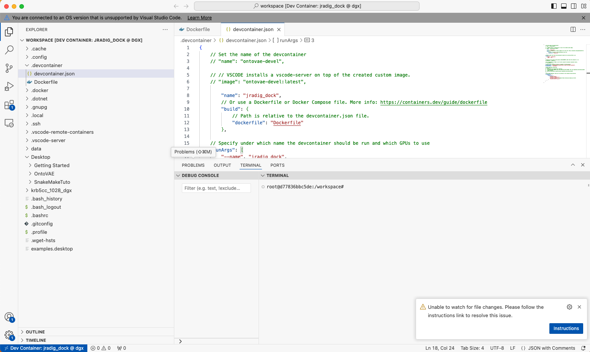

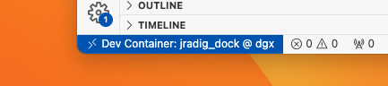

Hurray! 

You can open each folder in a separate vscode window, as you would do usually. You shouldn't be encountering any more problems. If you do, first go ask chatgpt. If it fails, ask google. If it fails, you are in trouble.

### 3) Questions/Remarks

If you have questions about this document, please ask Daria (daria.doncevic@bioquant.uni-heidelberg.de) or Jean (jean.radig@bioquant.uni-heidelberg.de).  

If you have additional remarks, let me know! If you think something else should be included here, please do so!


