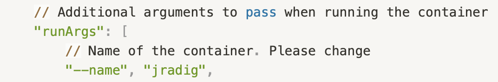
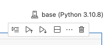
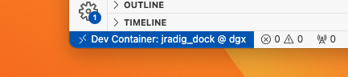

# Working in devcontainer

Working with Visual Studio Code has become a best practice due to its ease of integrating multiple languages simultaneously (e.g., Python and R) and various script modalities (e.g., Python scripts and Jupyter notebooks). Additionally, debugging and working with GitHub are seamlessly integrated within Visual Studio Code.

In the following section, we will demonstrate how to set up Visual Studio Code within a Docker container on the cluster. This setup enables you to develop in an environment that ensures compatibility between your packages while leveraging the computing power of the clusters.

In essence, this approach allows you to work comfortably on a powerful machine.

Assuming you already have Visual Studio Code installed and access to the DGX workstation, I recommend creating an automatic connection from your machine to the cluster using SSH key exchange authentication. You can achieve this by generating keys (keygen) and modifying the .bashrc file on your local machine. You can find detailed instructions on how to do this through a simple online search.

Please note that if you have access to GPU1 and GPU2 as well (fortunate you), you can follow the exact same procedures described below. You can keep the content of the .devcontainer unchanged, as it is not dependent on the cluster. As of the time of writing, the permissions granted to workspaces on the cluster did not allow for mounting the container from Visual Studio Code. By the time you read this, the issue should be resolved. If not, don't hesitate to seek assistance as the problem is already known.

# Connect to DGX via vsCode

Open vscode. 

In vscode, connect to the cluster by hitting the button on the left bottom corner:


And hit **Connect to host:**


If you have created an automatic connection in .bashrc it will appear automatically.


Otherwise you will need to enter user@host e.g. for me:

```python
[bq_jradig@cln-dgx.bioquant.uni-heidelberg.de](mailto:bq_jradig@cln-dgx.bioquant.uni-heidelberg.de)
```

And **then enter your password**.

A new window opens.


You see you are connected to DGX. 


# Create .devcontainer

Now, we are going to create two files, that are going to automatically create a docker - a docker is a bit like a conda environment, but that is saved on a kind of virtual machine. That means, regardless of whether you are using Mac, linux or windows (why would use the two latter even?), if everyone works on that docker, everyone can run the code. It's like a machine stored on a cloud. It is not though. You can google. Good luck to understand - and launch it on the cluster. 

The two files are going to be stored in a folder, that is going to be called .devcontainer (convention). It is going to contain two files: devcontainer.json (convention) and Dockerfile (needed, caps lock important). 

Go to your workspace:


Create the folder .devcontainer and create two files called devcontainer.json and Dockerfile inside them.


## devcontainer.json

In devcontainer.json, copy paste:

```python
{
    // Name of the development environment. Please change
    "name": "my_env",

    // Build configuration for the container
    "build": {
        // Specifies the Dockerfile to use for building the container
        "dockerfile": "Dockerfile"
    },

    // Additional arguments to pass when running the container
    "runArgs": [
        // Name of the container. Please change
        "--name", "jradig",

        // Enable GPU support for the container
        "--gpus", "all"
    ],

    // Configuration for mounting the workspace
    "workspaceMount": "source=${localWorkspaceFolder},target=/workspace,type=bind",
    
    // Specifies the folder inside the container to mount the workspace
    "workspaceFolder": "/workspace",
    
    // Customizations for VS Code inside the container
    "customizations": {
        "vscode": {
            // List of VS Code extensions to install in the container
            "extensions": [
                "ms-python.python",            // Python extension for VS Code
                "ms-python.vscode-pylance",    // Pylance extension for Python language support
                "ms-toolsai.jupyter",          // Jupyter support in VS Code
                "ms-python.black-formatter"    // Black formatter for Python code
            ]
        }
    }
}
```

Please modify the docker name 


and the image name 



Such that we know who did what. 

The following line is the most important:


It mounts all the files that you have on your cluster's workspace to the docker, in a folder that is called workspace. Hence all the files you have on the cluster will be accessible from the container. **Attention**, if you create folders from within the container (it will become clear at some point), you won't be able to scp to or from them, since you have created them from the container, and not from the cluster. If you want to scp stuff, create a folder on the cluster, and then open the project in the container. You will understand once you encounter the issue. Keep this warning in mind. 

## Dockerfile

The dockerfile specifies the image (kind of the virtual machine, though not quiet) that is going to be used. I was doing deep learning, so I pulled the image of pytorch. The image ensures there is no compatibility issues between your hardware and software (essentially, you can run stuff on the GPUs without problem). Additionally, you download the terminal widget you like (like nano, vim, unzip and so on) and the packages that you want to have installed (for example scanpy, pandas and else). The content of my docker file looks like (please copy paste and adjust): 

```python
FROM pytorch/pytorch:1.13.1-cuda11.6-cudnn8-runtime

# Install sudo and other system packages
RUN apt-get update && \
    apt-get install -y \
    sudo \
    git \
    htop \
    less \
    tmux

# Install required python packages
RUN pip install \
    ipython \
    ipykernel \
    black \
    goatools \
    scanpy \
    neptune \
    seaborn \
    colorcet \
    ray
```

Note that even once built, you can install more packages by running pip on the container terminal. It's like working in a normal machine. 

# Building the devcontainer

We have everything set to create the devcontainer. 

Hit cmd + shift + P (I hope you are using Mac). And hit “Dev Containers: Rebuild and Reopen in Container”.

 


It will load everything, it takes a couple of minutes at the beginning maybe. Hit **Allow**.


You are in the devcontainer! Hurray!


The terminal looks like this and you can use it like normal:


See, all the files you had on your cluster's workspace are now inside the container under the folder workspace. 

I can for instance run a python file from the terminal, like usual:


I can create a Jupyter notebook, just select the default kernel. 




And run it as usual.


You can import .py files in your Jupyter notebooks and all other stuff that you can usually do. 

But the most interesting thing, is that you can debug! Never used debugging? Google. In vscode you need to install an extension, easy. Then you can do e.g. the following.


It returns an error, let's debug. Set a flag (red dot, just click on the left of the line numbers to the line you wish the code to stop) and hit the run button with the bus on the left bottom corner:


Hit run and debug. Actually I suggest that you create the launch.json file they propose to automatically write for you. This will ensure that, each time you hit debug, it debugs the file that is currently open. 


Hence it does this step automatically:


You enter debug mode and you can debug as usual (look YouTube videos to understand how to debug. Don't wonder whether it's worth the time. It is.)


# Coming back to the devcontainer after having logged out


At the end of this tutorial, at some point, you are going to go home, and the connection to the cluster will be lost. You will have to reopen your work environment the next day. We are the next day. You reboot your computer. How to go back to your devcontainer and continue working? Follow me. 

Open vsCode. 

 


Connect to DGX


You were too lazy to create the key-authentification yesterday? You can still do it now.

The new window opens, you are connected to DGX. 


Click the TV icon:


Click on the drop-down menu “Remotes (Tunnels/SSH)”


Select Dev Containers


You can see all the devcontainers that were created, in particular yours (mine is bq_jradig jradig_dock)


I want to go to my workspace and I click the arrow.


I am back in my devcontainer




Hurray! 

You can open each folder in a separate vscode window, as you would do usually. You shouldn't be encountering any more problems. If you do, first go ask chatgpt. If it fails, ask google. If it fails, you are in trouble.